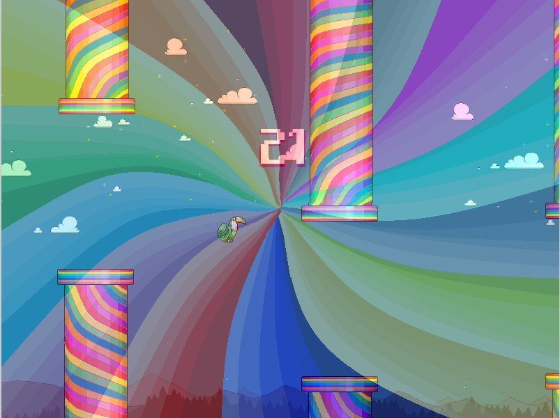

# Flappy Bird

## Descrição Geral
Este projeto é uma implementação em C++ do jogo "Flappy Bird", desenvolvido com o auxílio da biblioteca multimídia Allegro 5. Além da mecânica clássica de desviar dos obstáculos, o sistema foi expandido com funcionalidades extras para criar uma experiência mais completa.

### Sistema de Gerenciamento e Funcionamento do Jogo
- Cadastro de Jogadores: O jogo inicia com uma tela de cadastro, onde o jogador cria um apelido. Os dados de recorde e pontuação são salvos em um arquivo para garantir a persistência.
- Loop Principal: Durante a partida, o sistema processa continuamente a entrada do usuário (pulo), atualiza a física dos objetos, verifica colisões e renderiza todos os elementos na tela.
- Sistema de Ranking: Ao final de cada partida, a pontuação obtida é registrada e pode ser comparada com os recordes de outros jogadores.

### Principais Classes
1. **`Jogo`**:
   - Gerencia a inicialização e finalização da biblioteca Allegro 5, atuando como o "motor" principal e a base para a execução do jogo.

2. **`Cadastro`**:
   - Gerencia todo o subsistema de jogadores, incluindo a tela de registro, a persistência de dados em arquivo e a exibição do ranking.

3. **`Jogador`**:
   - Representa o pássaro controlado pelo usuário, contendo sua lógica de física (pulo, gravidade) e animação.

4. **`Pontos`**:
   - Gerencia a lógica de contagem de pontos durante a partida e sua exibição na tela
---

## Estrutura do Projeto
```plaintext
├── .vscode/     # Configurações de edição
├── assets/      # Imagens, fontes e arquivos de áudio
├── bin/         # Arquivos executáveis
├── include/     # Arquivos de cabeçalho (.hpp)
├── src/         # Código-fonte (.cpp), incluindo o main
├── tests/       # Arquivos de teste
├── CartõesCRC/  # Documentação com os cartões CRC
├── obj/         # Arquivos objeto gerados na compilação (.o)
├── Doxyfile     # Documentação gerada pelo Doxygen
├── Makefile     # Script para automação da compilação
└── README.md    # Documentação completa do projeto
```

### Funcionalidades Extras
- **Trilha sonora:** Uma trilha sonora autoral toca durante todo o jogo;
- **Fase Bônus Dinâmica: :** A cada 30 pontos, o jogo ativa uma fase "psicodélica" com duração de 10 tubos. Nela, os tubos se tornam coloridos, uma animação de espiral é sobreposta à tela e a música é alterada, aumentando o desafio e a variedade.




## Compilação e Execução

### Pré-requisitos
- **Linux/Windows**
- **Compilador C++**
- **Makefile**
- **Biblioteca Allegro 5**

### Passos para Compilação
1. Clone o repositório:
   ```bash
   git clone <URL_DO_REPOSITORIO>
   cd <DIRETORIO_DO_PROJETO>
   ```
2. Compile o programa:
   ```bash
   make
   ```
3. Execute o programa:
   ```bash
   ./bin/programa
   ```
4. Execute os testes: 
   - Teste do cadastro:
   ```bash
   make teste_cadastro
   ```
   - Teste do fundo:
   ```bash
   make teste_fundo
   ```
   - Teste do inicializador:
   ```bash
   make teste_inicializador
   ```
   - Teste do jogador:
   ```bash
   make teste_jogador
   ```
   - Teste dos pontos:
   ```bash
   make teste_pontos
   ```
   - Teste do tubo:
   ```bash
   make teste_tubo
   ```
5. Limpe os arquivos gerados: (Boa prática)
   ```bash
   make clean
   ```

---

## Documentação
1. Navegue até a pasta `docs/html`.
2. Abra o arquivo `index.html` em um navegador web.

---

## Principais Dificuldades e Aprendizados

### Dificuldades
1. **Gerenciamento de múltiplos arquivos**: Estruturar a lógica do projeto em múltiplas classes e arquivos, mantendo a coesão e o baixo acoplamento.

2. **Consistência dos dados**: Garantir que os dados dos jogadores fossem salvos e carregados do arquivo de ranking de forma consistente e sem corrupção.

3. **Balanceamento da Jogabilidade**: Encontrar as constantes ideais (gravidade, força do pulo, velocidade dos tubos) para criar uma curva de dificuldade divertida e visualmente agradável.

4. **Gerenciamento de memória e recursos com a Allegro**: Lidar com a alocação e liberação manual de recursos da Allegro (bitmaps, fontes, áudio) para evitar vazamentos de memória.
